# Лабораторная работа №4. Создание бэкенда на Express.js

## Содержание

1. [Постановка задачи](#постановка-задачи)
2. [Тема](#тема)
3. [Результат работы](#результат-работы)
4. [Дополнительное задание](#дополнительное-задание)

## Постановка задачи

**Задача** — разработать REST API сервис карточек `launchVehicle` c методами:

- GET `/launchVehicles/` — получение всех карточек
- POST `/launchVehicles` — создание новой карточки
- GET `/launchVehicles/:id` — получение карточки по ID
- PATCH `/launchVehicles/:id` — обновление карточки по ID
- DELETE `/launchVehicles/:id` — удаление карточки по ID

## Тема

**Сборка ракетоносителей Ангара разных типов**

В соответствии с темой, карточки содержат информацию о ракетоносителях (`launchVehicles`).

## Результат работы

### Запуск сервера

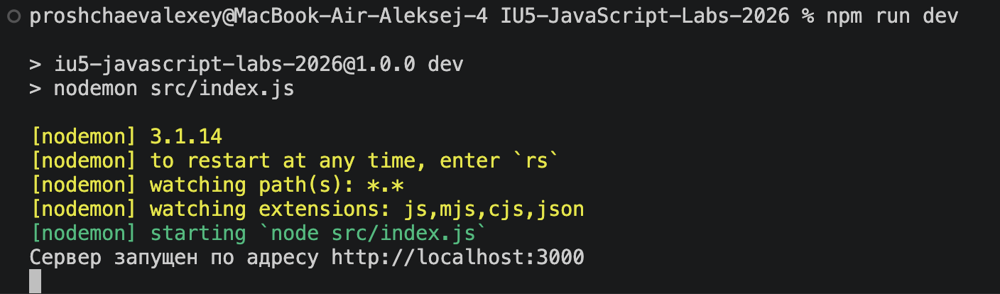


### GET /launchVehicles/ — получение всех карточек

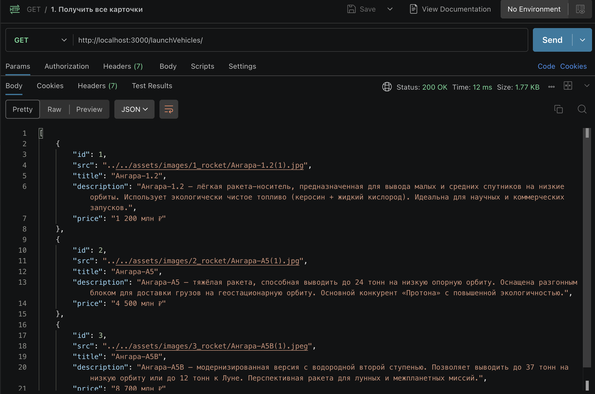
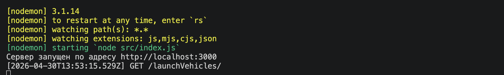

### GET /launchVehicles?title=Ангара-1.2 — поиск по названию

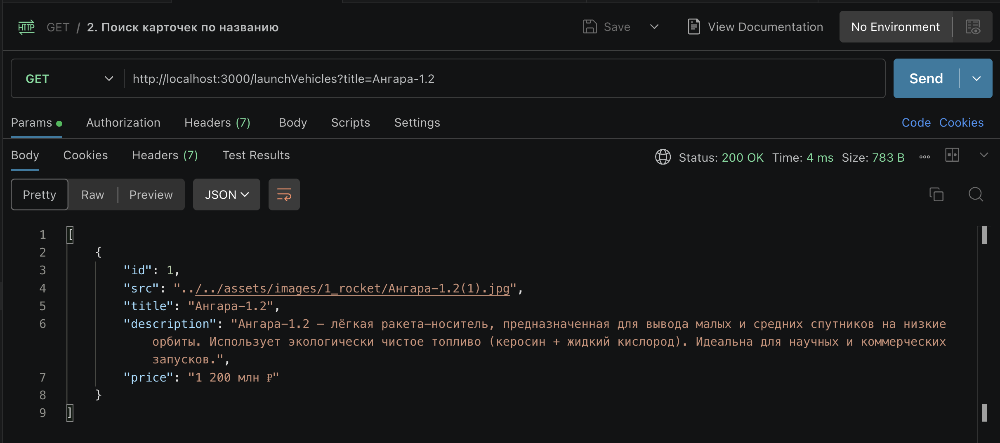

### POST /launchVehicles — создание новой карточки

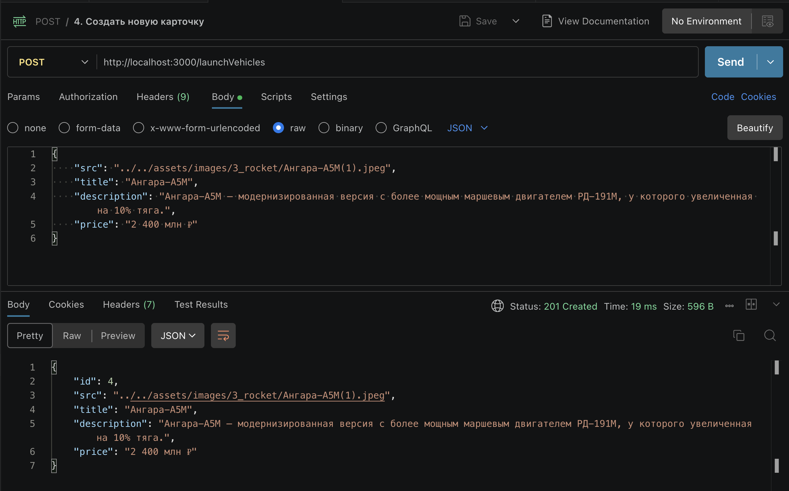

Проверка:

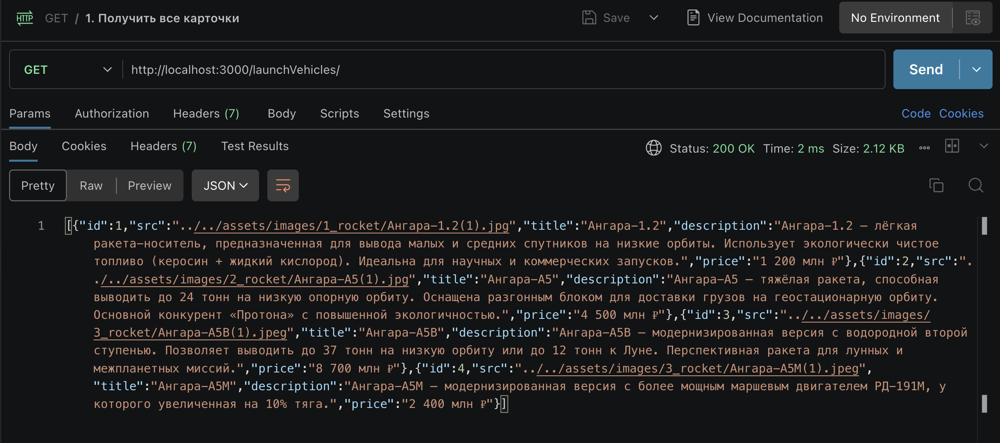

### GET /launchVehicles/:id — получение карточки по ID

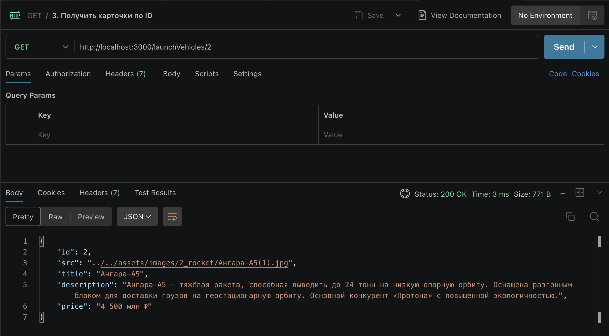

### PATCH /launchVehicles/:id — обновление карточки

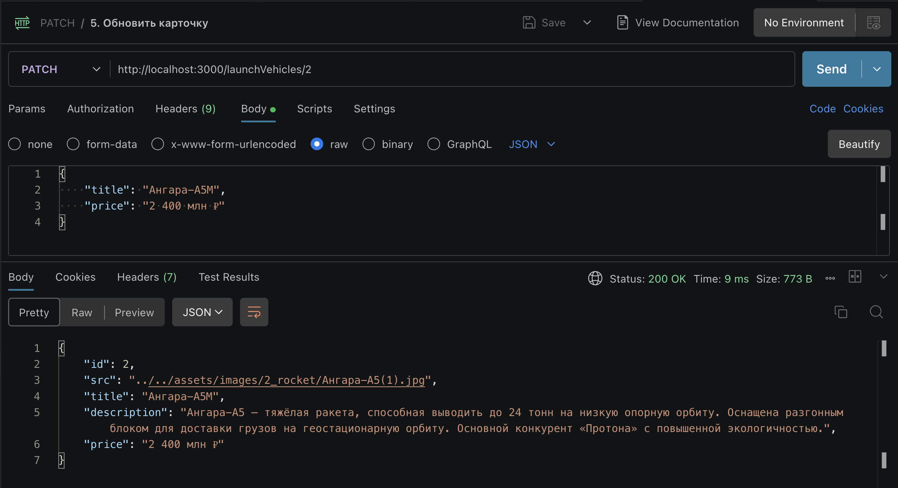

Проверка:

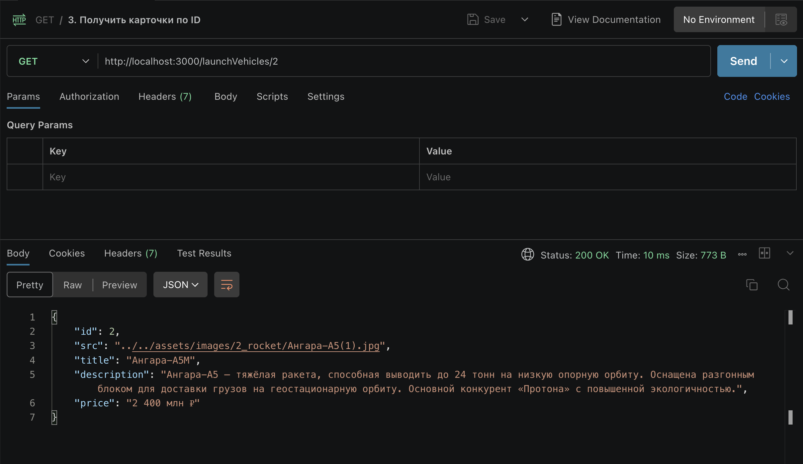

### DELETE /launchVehicles/:id — удаление карточки

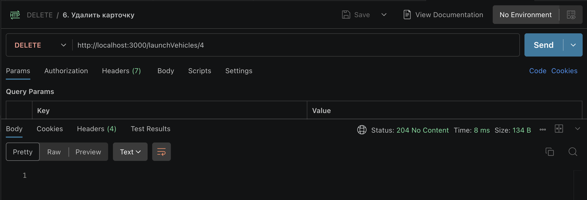

Проверка:

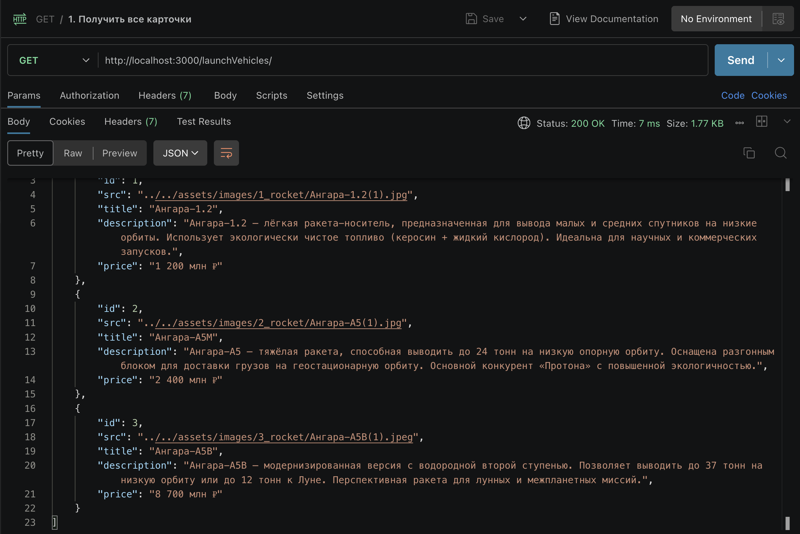

## Дополнительное задание

- Реализовать поиск карточек по **цене**

Функция `getAllLaunchVehicles(req, res)` теперь помимо параметра `title` учитывает `price`. Далее передаёт оба параметра в функцию `findAll(title, price)`.

```javascript
const getAllLaunchVehicles = (req, res) => {
    const { title, price } = req.query;
    const launchVehicles = launchVehiclesService.findAll(title, price);
    res.json(launchVehicles);
};
```

Функция `findAll(req, res)` читает все записи, а затем использует по очереди два параметра. Сначала фильтрует записи по названию, если оно задано, а потом - по цене. Если вдруг оба параметра не заданы (их значения равны `undefined`), функция возвращает все записи.

```javascript
const findAll = (title, price) => {
    const launchVehicles = fileService.readData(dataFilePath);

    if (!title & !price) {
        return launchVehicles;
    }

    let filteredLaunchVehicles = launchVehicles;

    if (title) {
        filteredLaunchVehicles = filteredLaunchVehicles.filter(launchVehicle => 
            launchVehicle.title.toLowerCase().includes(title.toLowerCase())
        );
    }

    if (price) {
        filteredLaunchVehicles = filteredLaunchVehicles.filter(launchVehicle => 
            launchVehicle.price.toLowerCase().includes(price.toLowerCase())
        );
    }

    return filteredLaunchVehicles;
};
```

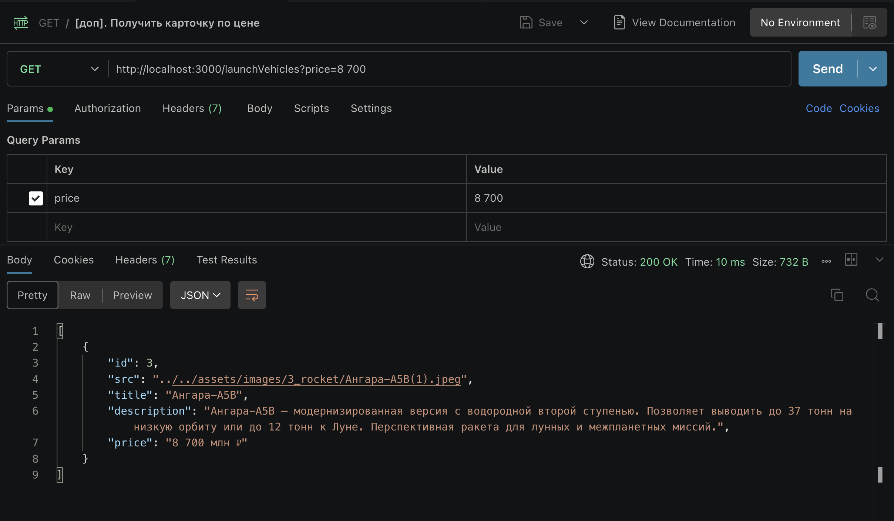