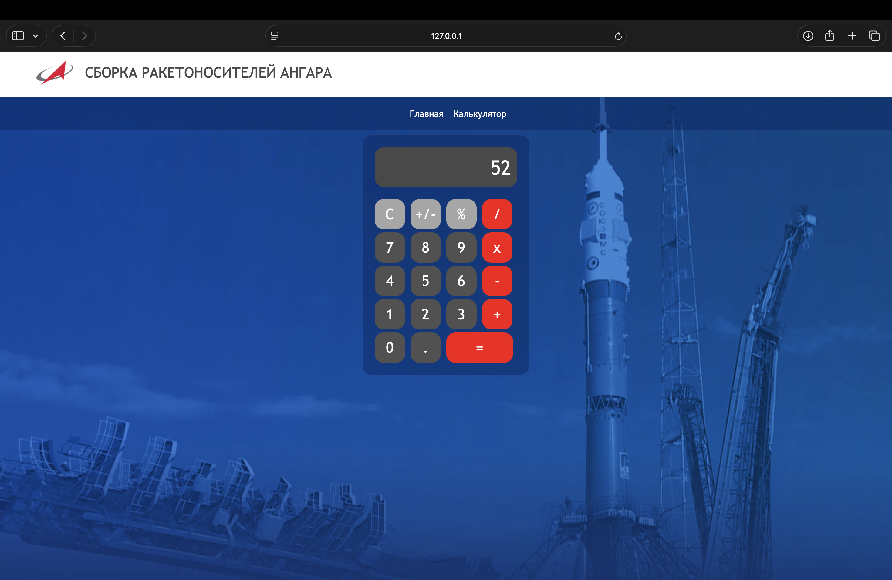
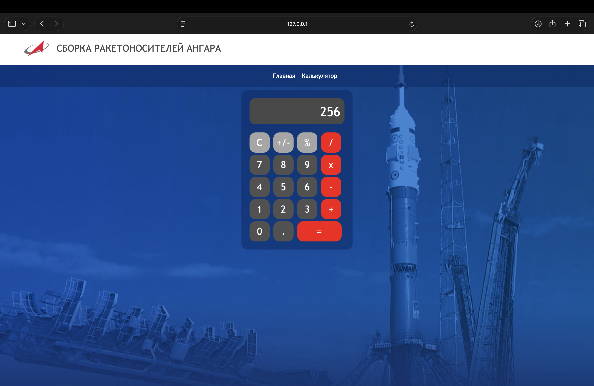
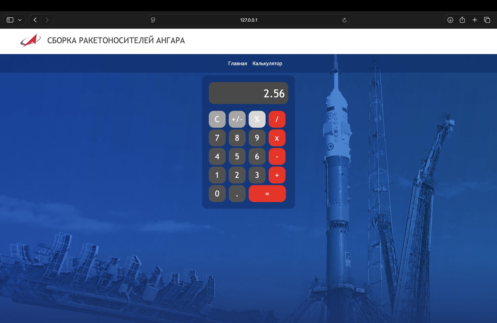
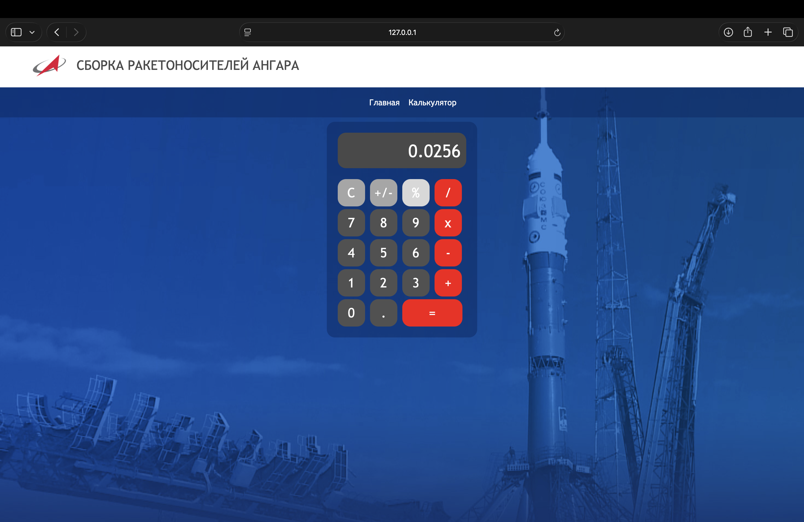
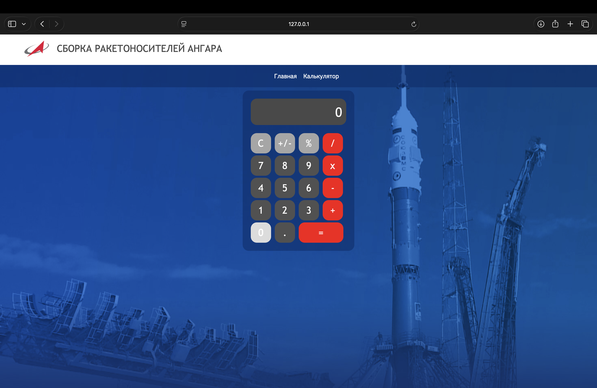
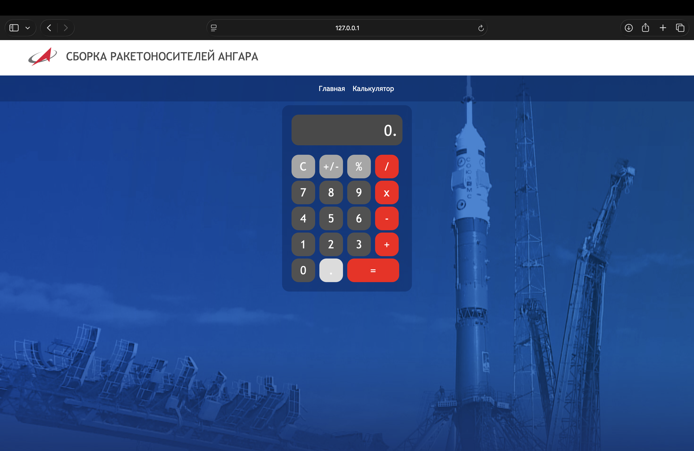

# Лабораторная работа №2. Калькулятор и JavaScript

## Содержание

1. [Постановка задачи](#постановка-задачи)
2. [Сайт, выбранный за основу](#сайт-выбранный-за-основу)
3. [Выполнение задания](#выполнение-задания)

## Постановка задачи

**Цель** данной лабораторной работы - знакомство с инструментами построения пользовательских интерфейсов web-сайтов: HTML, CSS, JavaScript. В ходе выполнения работы, предстоит продолжить реализовывать простой калькулятор.

## Сайт, выбранный за основу

Российский сайт компании "Роскосмос": https://www.roscosmos.ru.

**P.S.** Сайт Роскосмос поменял свой стиль, поэтому его стилистика не совпадает со стилистикой сайта с калькулятором.

## Выполнение задания

### Добавление функциональности кнопке смены знака (+/-)

Добавлена обработка нажатия на кнопку смены знака. Операция работает как для первого числа, так и для второго.

```js
document.getElementById("btn_op_sign").onclick = function() {
        if (!selectedOperation) {
            let numberWithOppositeSign = (-a);
            a = numberWithOppositeSign.toString();
            outputElement.innerHTML = a;
        }
        else {
            let numberWithOppositeSign = (-b);
            b = numberWithOppositeSign.toString();
            outputElement.innerHTML = b;
        }
    }
```




### Добавление функциональности кнопке операции процент (%)

Язык JavaScript неточно производит вычисления с плавающей точкой. Поэтому вместо простого деления числа на 100, функция для операции процента работает с числами, как со строками. Она обрабатывает разные случаи и либо корректно добавляет точку, либо передвигает её. Ниже приведена реализации этой самой функции.

```js
document.getElementById("btn_op_sign").onclick = function() {
        if (!selectedOperation) {
            let numberWithOppositeSign = (-a);
            a = numberWithOppositeSign.toString();
            outputElement.innerHTML = a;
        }
        else {
            let numberWithOppositeSign = (-b);
            b = numberWithOppositeSign.toString();
            outputElement.innerHTML = b;
        }
    }

    this.document.getElementById("btn_op_percent").onclick = function() {
        if (!selectedOperation) {
            a = DoOperationPercent(a);
            outputElement.innerHTML = a;
        }
        else {
            b = DoOperationPercent(b)
            outputElement.innerHTML = b;
        }
    }

    function DoOperationPercent(number) {
        if (number[number.length - 1] == '.') {
            number = number.substring(0, number.length - 1);
        }

        if (number === '0') {
            return number;
        }

        const sign = (number.startsWith('-')) ? '-' : '';
        number = Math.abs(+number).toString();
        
        if (number.includes('.')) {
            number = MovePoint(number);
        }
        else {
            number = AddPoint(number);
        }

        return sign + RemoveExtraEndZero(number);
    }

    function MovePoint(number) {
        const indexOfPoint = number.indexOf('.');
        const beforePointPart = number.substring(0, indexOfPoint);
        const afterPointPart = number.substring(indexOfPoint + 1, number.length);

        if (number.indexOf('.') == 1) {
            return '0.0' + beforePointPart + afterPointPart;
        }

        if (number.indexOf('.') == 2) {
            return '0.' + beforePointPart + afterPointPart;
        }

        if (number.indexOf('.') > 2) {   
            const afterPointFuturePart = beforePointPart.substring(beforePointPart.length - 2, beforePointPart.length) + afterPointPart;
            const beforePointFuturePart = beforePointPart.substring(0, number.length - 2);

            return beforePointFuturePart + '.' + afterPointFuturePart
        }
    }

    function AddPoint(number) {
        if (number.length == 1) {
            return '0.0' + number;
        }

        if (number.length == 2) {
            return '0.' + number;
        }

        if (number.length > 2) {
            const indexOfSegmentation = number.length - 2;
            const beforePointFuturePart = number.substring(0, indexOfSegmentation);
            const afterPointFuturePart = number.substring(indexOfSegmentation, number.length);
            return beforePointFuturePart + '.' + afterPointFuturePart;
        }
    }

    function RemoveExtraEndZero(number) {
        return (+number).toString();
    }
```





### Фикс ошибок, связанных с набором множества нулей и отсутствием цифр перед десятичной точкой
Когда пользователь пытается добавить ещё один ноль, приложение проверяет, является уже набранное число нулём. Если является, то второй ноль не прибавляется.

Также, теперь по умолчанию у калькулятора значение ноль, а не пустая строка. Если набрать точку в начале работы, получится "0." вместо ".".



