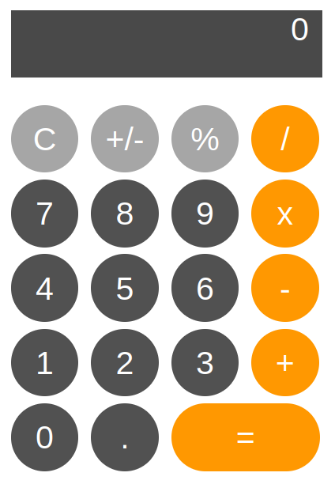
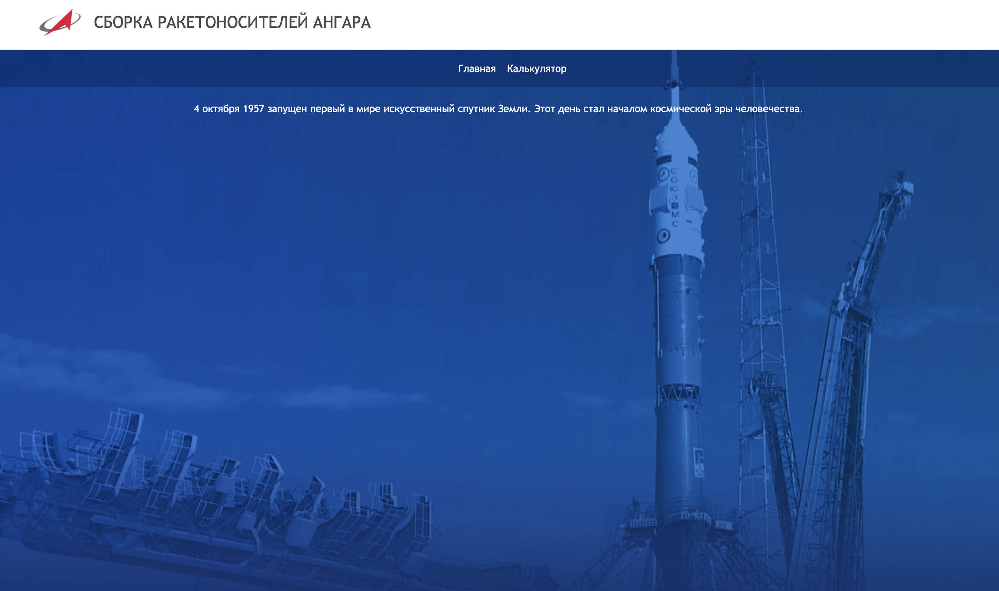
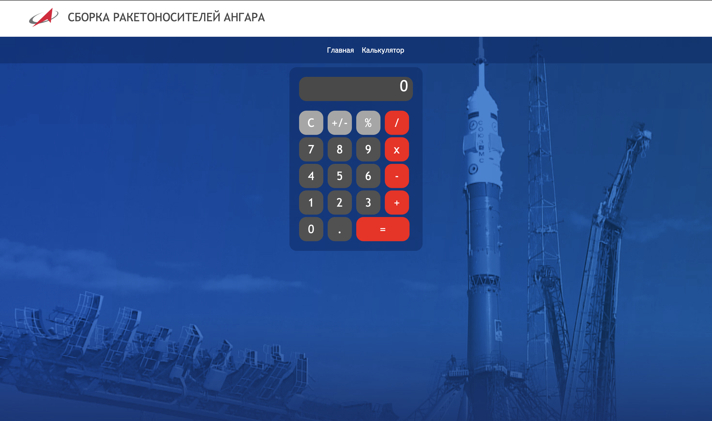

# Лабораторная работа №1. Калькулятор

## Содержание

1. [Постановка задачи](#постановка-задачи)
2. [Выполнение задания](#выполнение-задания)
3. [Результат работы](#результат-работы)


## Постановка задачи

**Цель** данной лабораторной работы - знакомство с инструментами построения пользовательских интерфейсов web-сайтов: HTML, CSS. В ходе выполнения работы, предстоит ознакомиться с кодом реализации простого калькулятора, и затем стилизовать страничку с калькулятором в соответствии с выбранной темой.



**Тема:** Сборка ракетоносителей Ангара разных типов. 

В качестве образца выбран сайт [Роскосмос](https://www.roscosmos.ru).


## Выполнение задания

### Разметка (HTML)

Шапка имеет 2 раздела: главная страница и страница с калькулятором. Код шапки:
```html
<div class="tm">
  <ul class="menu">
      <li class="li1">
          <a href="index.html"> Главная</a>
      </li>
      <li class="li1">
          <a href="calculator.html">Калькулятор</a>
      </li>
  </ul>
</div>
```

### Стили (СSS)

Элементам шапки в соответствии с образцом была добавлена особая анимация. При наведении на элемент появляется красная линия, которая растягивается от левой границы до правой. Эта анимация реализована с помощью псевдоэлемента ```::before```. По умолчанию он имеет нулевую ширину (```width: 0%;```) и поэтому красная линия не видна. При наведении она занимает всю ширину элемента (```width: 100%;```). Изменение описано с помощью атрибута: ```transition: all 0.3s linear;```. Фрагмент кода, содержащий стилизацию элементов шапки:

```css
.li1 > a:hover {
    transition: all 0.3s linear;
    color: #0bb5ff;
    background: rgb(33, 65, 128);
}

.tm .li1 > a::before {
    transition: all 0.3s linear;
    display: block;
    background: #fa0a11;
    position: absolute;
    left: 0;
    top: 0;
    width: 0%;
    height: 3px;
    content: "";
}

.tm .li1 > a:hover:before {
    width: 100%;
}
```

Силь кнопок калькулятора был подобран в соответствии со стилистикой образца. У кнопок изменён цвет: ```background: #fa0a11;``` и радиус кривизны границы: ```border-radius: 15px;```. Ниже представлен фрагмет кода со стилизацией кнопок калькулятора:

```css
.my-btn { 
  margin-right: 5px;
  margin-top: 5px;
  width: 50px;
  height: 50px;
  border-radius: 15px;
  border: none;
  background: #515151;
  color: white;
  font-size: 1.5rem;
  font-family: "Segoe UI", "Trebuchet MS", sans-serif;
  cursor: pointer;
  user-select: none;
} 

.my-btn:hover {
  background: darkgray;
}

.my-btn:active {
  filter: brightness(130%);
}

.my-btn.primary { 
  background: #fa0a11;
}

.my-btn.secondary { 
  background: #a6a6a6;
}

.my-btn.execute { 
  width: 110px;
  border-radius: 15px;
}
```

## Результат работы
### Главная страница

### Страница с калькулятором

