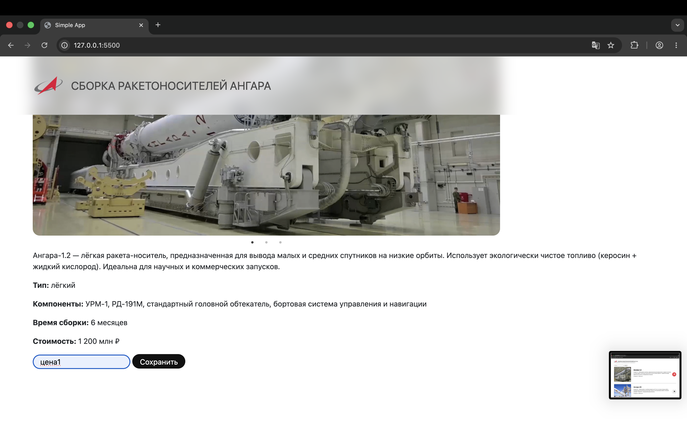
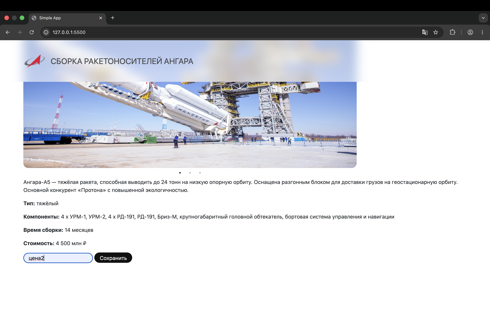
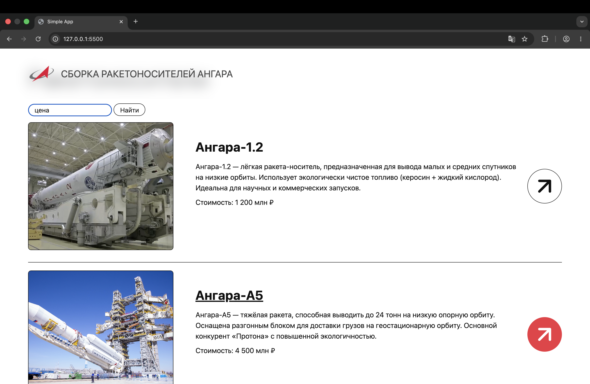
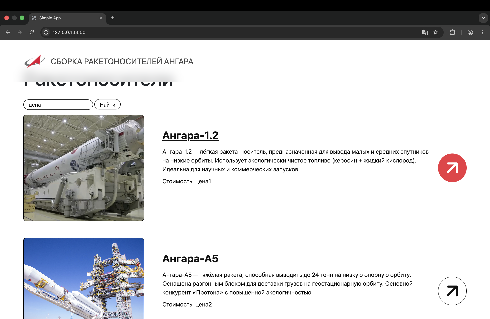

# Лабораторная работа №5. Добаление AJAX запросов к API

## Содержание

1. [Постановка задачи](#постановка-задачи)
2. [Тема](#тема)
3. [Сайт, выбранный за основу](#сайт-выбранный-за-основу)
4. [Результат работы](#результат-работы)
5. [Дополнительное задание](#дополнительное-задание)

## Постановка задачи

**Цель** данной лабораторной работы - взаимодействие с внешним API через XMLHttpRequest. В ходе выполнения работы, предстоит реализовать простое взаимодействие с внешним API, получение данных и вывод их в интерфейс пользователя.

## Тема

**Сборка ракетоносителей Ангара разных типов**

## Сайт, выбранный за основу

Российский сайт компании "Роскосмос", вкладка "Новости": https://www.roscosmos.ru/102/.


## Результат работы

Раньше данные хранились в коде JavaScript. Метод `getData()` возвращал статический набор данных `data`.

Теперь метод `getData()` делает запрос на бэкенд сервер. Результат приходит через колбэк, который рендерит карточки продуктов.

Чтобы обойти политику CORS, блокирующую запросы на другие серверы, используется специальное расширение `CORS Unblock`.

Данная схема используется для главной страницы и страницы продукта. Ниже приведён код для главной страницы:

```javascript
getData() {
    ajax.get(launchVehicleUrls.getLaunchVehicles(), (data) => {
        this.renderData(data);
    })
}

renderData(items) {
    items.forEach((item) => {
        const productCard = new ProductCardComponent(this.pageRoot)
        productCard.render(item, this.clickCard.bind(this))
    })
}
```


## Дополнительное задание

### Формулировка

- Реализовать возможность отправки запроса на сервер бэкенда
- Реализовать поиск карточек
- Установить задержку на стороне фронтенда для демонстрации асинхронности языка JavaScript

### Выполнение задания 

#### Добавление поля для ввода новой цены
С помощью PATCH запроса будет меняться цена сборки ракетоносителя. В компонент продукта добавлено поле для ввода новой цены и кнопка для отправки данных на сервер:

```html
<input type="string" id="new-price-input" class="black-input" placeholder="Новая цена">
                    <button id="save-price-btn" class="black-btn">Сохранить</button>
```

Для кнопки добавлен обработчик, введена искусственная задержка 20 секунд: 
```javascript
updatePrice() {
    const newPrice = document.getElementById("new-price-input").value;

    setTimeout(() => {
        ajax.patch(launchVehicleUrls.updateLaunchVehicleById(this.id), {price: newPrice}, () => {});
    }, 20000);
}
```
#### Обработка preflight

PATCH запрос является сложным запросом, поэтому на бэкенд сначала отправляется OPTIONS запрос. Ответ на него должен содержать список возможных методов (среди них должен быть PATCH). Только после этого отправляется PATCH запрос. На стороне бэкенд сервера добавлено:
```javascript
app.options('/launchVehicles/:id', (req, res) => {
    res.setHeader('Access-Control-Allow-Origin', '*');
    res.setHeader('Access-Control-Allow-Methods', 'GET, POST, PATCH, DELETE, OPTIONS');
    res.setHeader('Access-Control-Allow-Headers', 'Content-Type');
    res.sendStatus(204);
});
```

#### Поиск карточки
Добавлен компонент `search-field`. Он используется на главной странице и состоит из строки ввода и кнопки поиска. Поиск происходит только по цене.

### Демонстрация
Цена до обновления

Обновление цены для первого ракетоносителя

Обновление цены для второго ракетоносителя

Цена не изменилась из-за искусственно созданной задержки.

Необходимо немного подождать, чтобы PATCH запросы пришли на сервер. Далее выполним поиск - цена карточек успешно обновлена.


#### Важное замечание

После нажатия кнопки для отправки PATCH запроса нельзя перезагружать страницу. В противном случае запрос, который ждёт 20 секунд, уничтожится и в конечном счёте не дойдёт до сервера. Поэтому для возврата к общему списку ракетоносителей следует использовать кнопку, потому что она не перезагружает страницу, а динамически рендерит её содержимое. Запросы не уничтожаются.