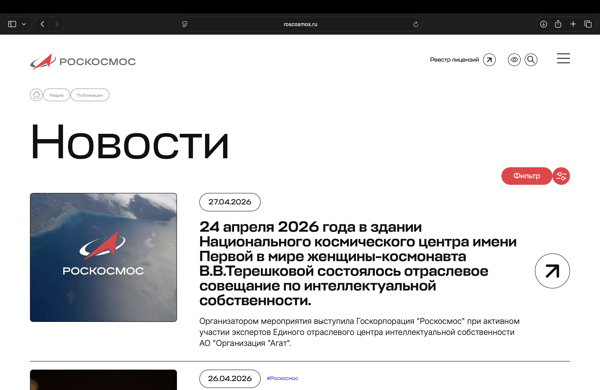
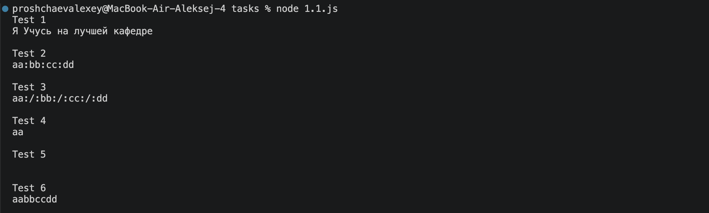
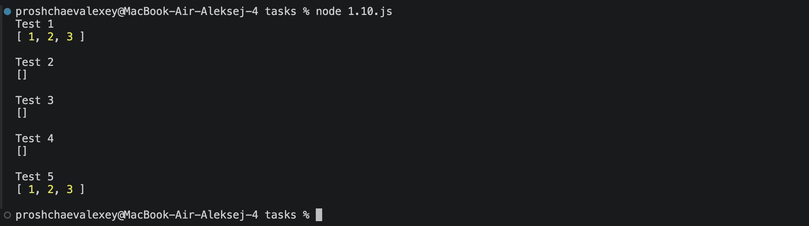
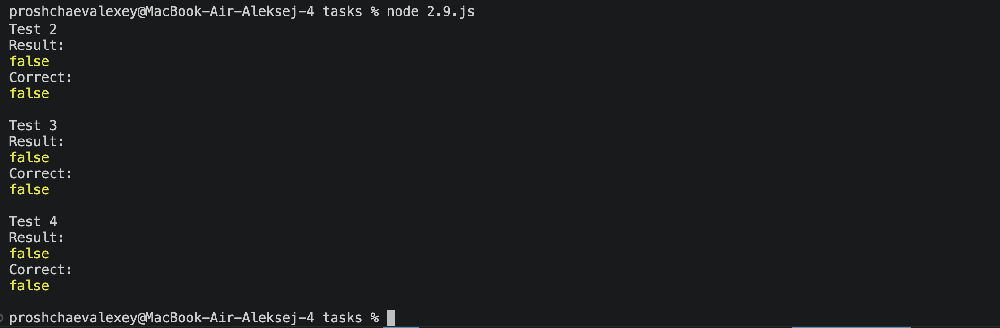
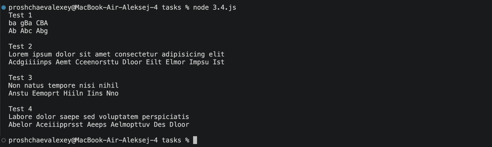
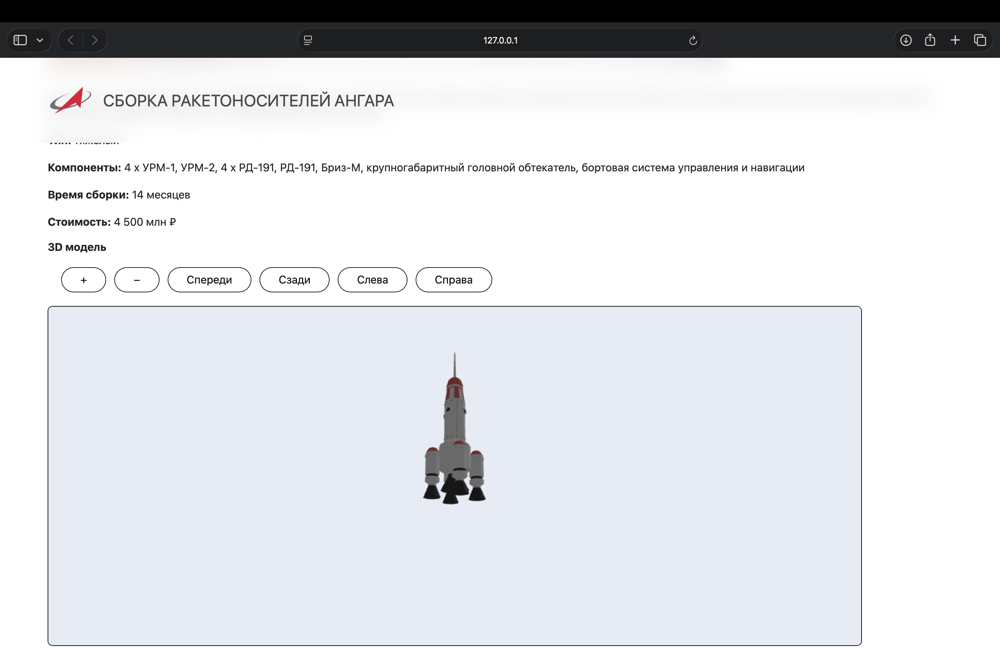
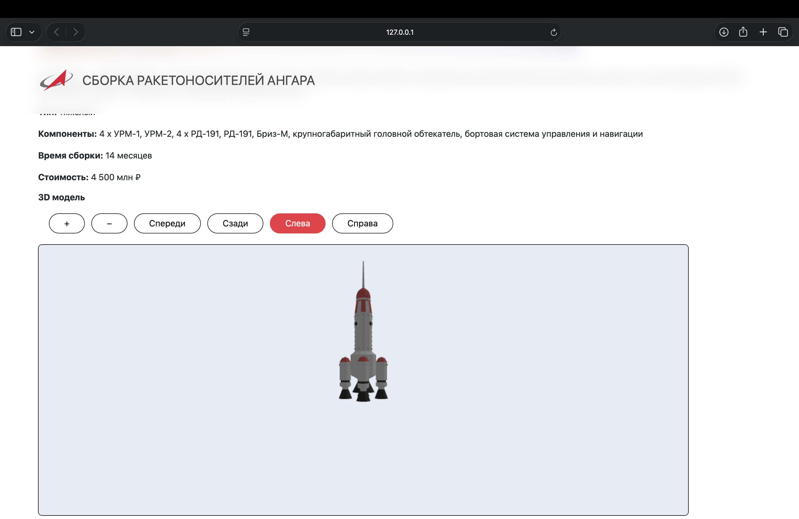

# Домашнее задание №1. Коллекции, функции, классы. 3D модели

## Содержание

1. [Постановка задачи](#постановка-задачи)
2. [Тема](#тема)
3. [Сайт, выбранный за основу](#сайт-выбранный-за-основу)
4. [Коллекции, функции, классы](#коллекции-функции-классы)
5. [3D модели](#3d-модели)

## Постановка задачи

**Задание**: Работа с коллекциями, функциями, классами.
**Порядок показа**: объяснить реализацию требуемых функций, объяснить использование three.js

### Первая часть

Домашнее задание состоит из 2 частей. В `первой части` ДЗ необходимо выполнить задания по варианту (см ниже), причём два из них надо внедрить в приложение третьей лабораторной. 

#### Задание 1.1 (`1 уровень`)

Напишите функцию `concatenate`, которая принимает массив строк и символ-разделитель. Функция должна вернуть строчку
склеенную по данному разделителю.

```js
concatenate(['Я','Учусь','на','лучшей','кафедре'], ' ') // Я учусь на лучшей кафедре
```

#### Задание 1.10 (`1 уровень`)

Напишите функцию `erase`, которая очищает массив от нежелательных значений, таких как false, undefined, пустые строки, ноль, null.

```js
const data = [0, 1, false, 2, undefined, '', 3, null];
console.log(erase(data)) // [1, 2, 3]
```

#### Задание 2.9 (`2 уровень`)

Написать функцию, которая проверит можно ли получить из одного массива другой каким-либо способом.

Пример
Даны два массива
[1, 2, 3, 8, -2] и [2, 3, 8, 1, -2]
Результат: true

#### Задание 3.4 (`3 уровень`)

Напишите функцию `sort`, которая будет сортировать буквы в словах по алфавиту,
а потом получившиеся слова в предложении — тоже.
Первую букву каждого слова она сделает прописной, остальные — строчными

### Вторая часть

Во `второй части` ДЗ необходимо на странице Подробнее выводить вместе с картинкой 3D модель. Модель `.glb` должна быть по теме работы.


## Тема

**Сборка ракетоносителей Ангара разных типов**

## Сайт, выбранный за основу

Российский сайт компании "Роскосмос", вкладка "Новости": https://www.roscosmos.ru/102/.



## Коллекции, функции, классы

### Задание 1.1
Тестовый пакет:
```javascript
const test_data = [
    {
        id: 1,
        list: ['Я','Учусь','на','лучшей','кафедре'],
        separator: " "
    },
    {
        id: 2,
        list: ["aa", "bb", "cc", "dd"],
        separator: ":"
    },
    {
        id: 3,
        list: ["aa", "bb", "cc", "dd"],
        separator: ":/:"
    },
    {
        id: 4,
        list: ["aa"],
        separator: ":/:"
    },
    {
        id: 5,
        list: [],
        separator: ":/:"
    },
    {
        id: 6,
        list: ["aa", "bb", "cc", "dd"],
        separator: ""
    },
]
```
Результат работы:



### Задание 1.10
Тестовый пакет:
```javascript
const test_data = [
    {
        id: 1,
        list: [0, 1, false, 2, undefined, '', 3, null],
    },
    {
        id: 2,
        list: [undefined, null],
    },
    {
        id: 3,
        list: [""],
    },
    {
        id: 4,
        list: [0],
    },
    {
        id: 5,
        list: [1, 2, 3],
    },
]
```
Результат работы:



### Задание 2.9
Тестовый пакет:
```javascript
const test_data = [
    {
        id: 1,
        initial: [1, 2, 3, 8, -2],
        final: [2, 3, 8, 1, -2],
        correct: true
    },
    {
        id: 2,
        initial: [1, 1, 1],
        final: [1, 1],
        correct: false
    },
    {
        id: 3,
        initial: [1, 1, 1],
        final: [1, 1, 2],
        correct: false
    },
    {
        id: 4,
        initial: [1, 1, 2],
        final: [1, 2, 2],
        correct: false
    },
]
```
Результат работы:



### Задание 3.4
Тестовый пакет:
```javascript
const test_data = [
    {
        id: 1,
        sentence: "ba gBa CBA",
    },
    {
        id: 2,
        sentence: "Lorem ipsum dolor sit amet consectetur adipisicing elit",
    },
    {
        id: 3,
        sentence: "Non natus tempore nisi nihil",
    },
    {
        id: 4,
        sentence: "Labore dolor saepe sed voluptatem perspiciatis",
    },
]
```
Результат работы:



### Внедрение в лабораторную работу №3

В приложение были внедрены функции `concatenate()` и `erase()` из заданий 1.1 и 1.10 соответственно.

Функция `concatenate()` используется для объединения названий компонентов ракетоносителя в одну строчку. Компоненты разделяются запятой и пробелом. Полученная строка выводится на экран.

Функция `erase()` используется для удаления нулевых значений из списка компонентов ракетоносителя. Для всех ракетоносителей есть стандартизированный набор компонентов. Если ракетоноситель не использует определённые компоненты, на их месте стоит значение `null`.

Использование методов: 
```html
<p class="card-components"><b>Компоненты:</b> ${concatenate(erase(data.components), ", ")}</p>
```


## 3D модели

Для использования 3D моделей скачана библиотека `three` с помощью покетного менеджера `npm`.

Создан новый компонент `Model3DComponent`. Для отрисовки 3D модели используется `<canvas>`.


