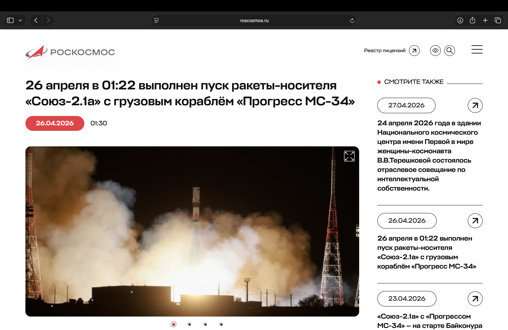
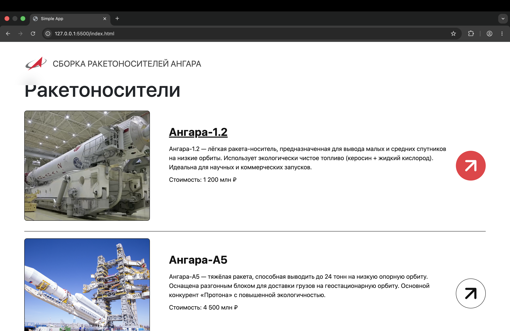
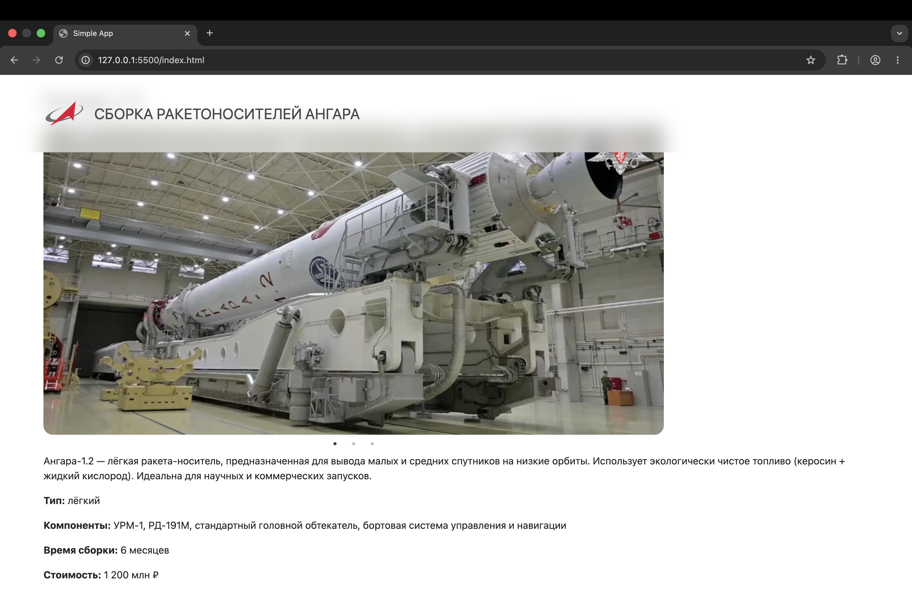
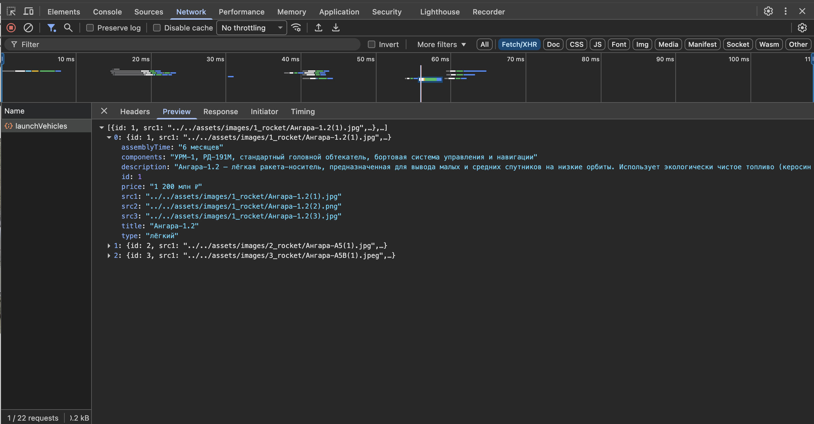

# Лабораторная работа №5. Добаление AJAX запросов к API

## Содержание

1. [Постановка задачи](#постановка-задачи)
2. [Тема](#тема)
3. [Сайт, выбранный за основу](#сайт-выбранный-за-основу)
4. [Результат работы](#результат-работы)
5. [Дополнительное задание](#дополнительное-задание)

## Постановка задачи

**Цель** данной лабораторной работы - взаимодействие с внешним API через XMLHttpRequest. В ходе выполнения работы, предстоит реализовать простое взаимодействие с внешним API, получение данных и вывод их в интерфейс пользователя.

## Тема

**Сборка ракетоносителей Ангара разных типов**

## Сайт, выбранный за основу

Российский сайт компании "Роскосмос", вкладка "Новости": https://www.roscosmos.ru/102/.




## Результат работы

Раньше данные хранились в коде JavaScript. Метод `getData()` возвращал статический набор данных `data`.

Теперь метод `getData()` делает запрос на бэкенд сервер. Результат приходит через колбэк, который рендерит карточки продуктов.

Чтобы обойти политику CORS, блокирующую запросы на другие серверы, используется специальное расширение `CORS Unblock`.

Данная схема используется для главной страницы и страницы продукта. Ниже приведён код для главной страницы:

```javascript
getData() {
    ajax.get(launchVehicleUrls.getLaunchVehicles(), (data) => {
        this.renderData(data);
    })
}

renderData(items) {
    items.forEach((item) => {
        const productCard = new ProductCardComponent(this.pageRoot)
        productCard.render(item, this.clickCard.bind(this))
    })
}
```





## Дополнительное задание
