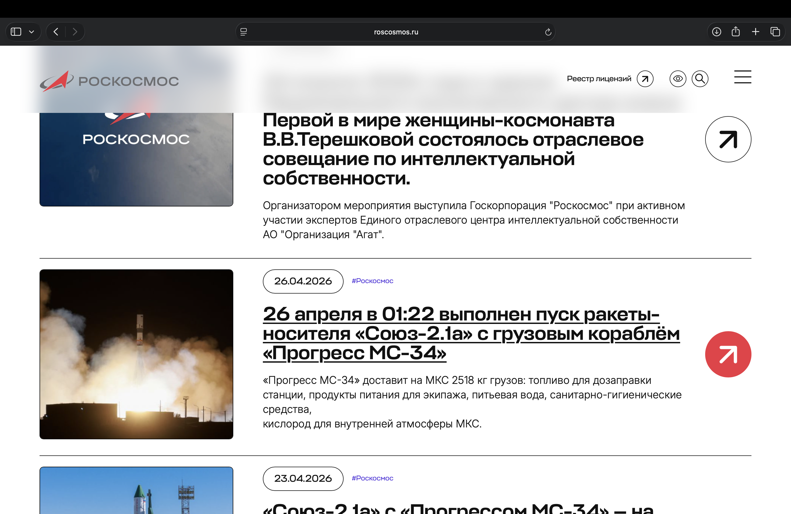
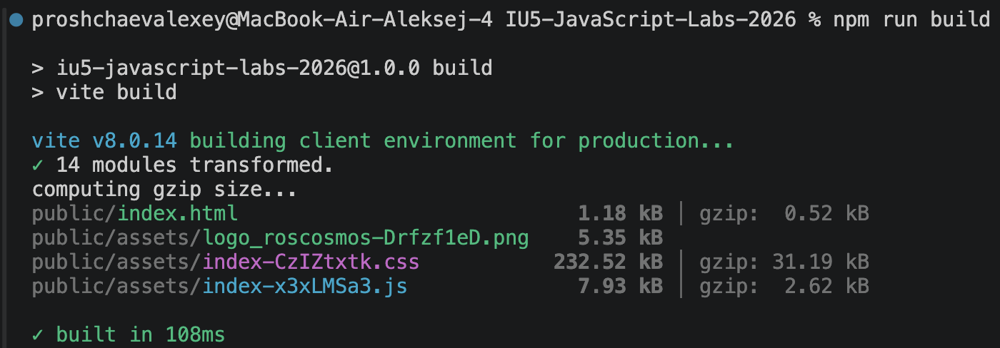
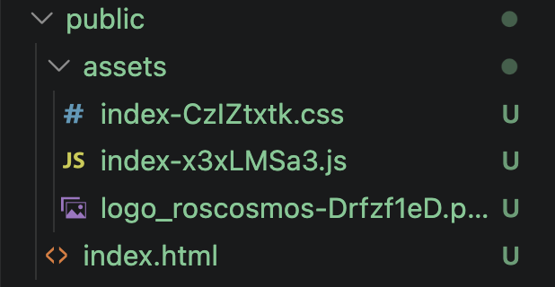
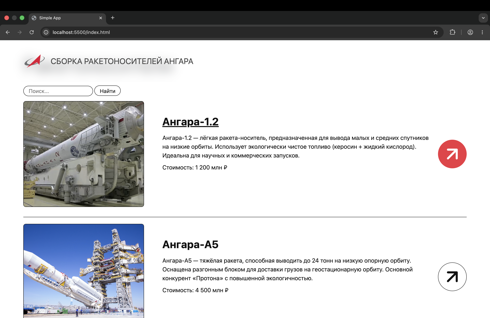
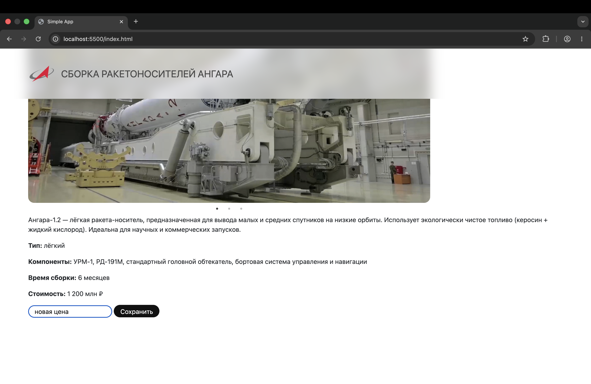
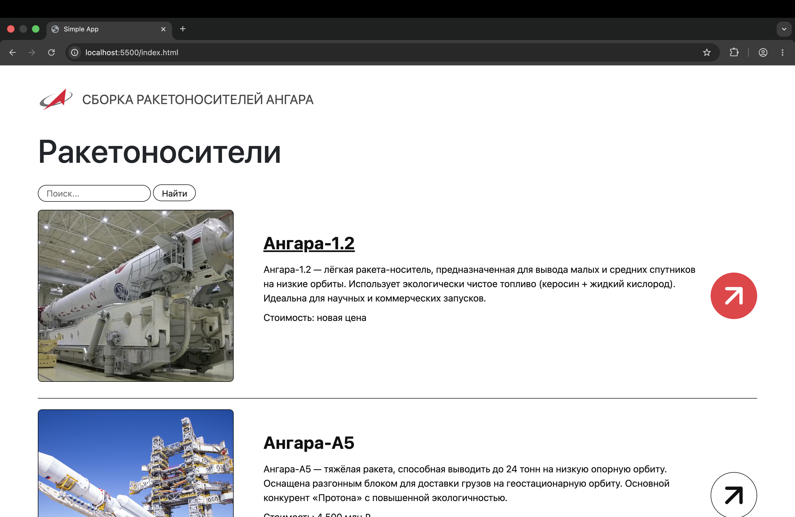

# Лабораторная работа №6. Знакомство с promise и fetch. Cборка клиентской части

## Содержание

1. [Постановка задачи](#постановка-задачи)
2. [Тема](#тема)
3. [Сайт, выбранный за основу](#сайт-выбранный-за-основу)
4. [Результат работы](#результат-работы)
5. [Дополнительное задание](#дополнительное-задание)

## Постановка задачи

Лабораторная состоит из 2-х частей:

**Первая часть** данной лабораторной работы заключается в изменении механизма взаимодействия с внешним API: в прошлой лабораторной работе использовался XMLHttpRequest, в этой - современный метод fetch. 

**Вторая часть** лабораторной работы заключается в сборке клиентской части приложения: необходимо "сбилдить" клиентскую часть с помощью системы сборки, а также добавить в серверную часть возможность раздачи клиентской части в качестве статики во избежание проблем с CORS.

## Тема

**Сборка ракетоносителей Ангара разных типов**

## Сайт, выбранный за основу

Российский сайт компании "Роскосмос", вкладка "Новости": https://www.roscosmos.ru/102/.





## Результат работы

### Замена XHR на fetch с использованием async, await

Метод для выполнения `GET` запроса в классе `Ajax` переписан c использованием ключевых слов async и await, делающих работу с promise более удобной. Также используется метод `fetch()` который выполняет сам запрос.

Запрос, упакованный в промис, передаётся в обработчик. Если запрос по какой то причине не валидный, выводится сообщение об ошибке, когда промис разрешится. Если с запросом всё хорошо, json парсится и в результате возвращаются данные с сервера, обёрнутые в неразрешённый промис.

```javascript
async get(url) {
    try {
        const response = await fetch(url);
        return this._handleResponse(response);
    } catch(error) {
        console.log(`Невозможно получить доступ к серверу: ${error}`);
    }
}

async _handleResponse(response) {
    if (!response.ok) {
        const text = await response.text();
        console.log(`HTTP ${response.status}: ${text || response.statusText}`);
    }
    const contentType = response.headers.get('content-type');
    if (contentType && contentType.includes('application/json')) {
        return response.json();
    }
    return response.text();
}
```

Метод `getData()` главной страницы ждёт разрешения промиса, после чего рендерит содержимое. Всё то же самое сделано для страницы продукта.

```javascript
async getData(price = null) {
    try {
        const data = await ajax.get(launchVehicleUrls.getLaunchVehicles(price));
        this.renderData(data);
    } catch (error) {
        console.error('Ошибка загрузки данных:', error);
    }
}
```

### Сборка клиентской части с использованием vite

Запуская команду `npm run build` собирается клиентская часть в папке `/public`.




## Дополнительное задание

### Формулировка 

- Замена всех вызовов и использований XMLHttpRequest на fetch

### Выполнение
Оставшиеся методы для выполнения запросов (`POST`, `PATCH`, `DELETE`) переписаны с использованием метода `fetch()` и ключевых слов `async` и `await`.

Метод для обновления стоимости на странице продукта, также переписан под новый механизм:
```javascript
async updatePrice() {
    const newPrice = document.getElementById("new-price-input").value;

    setTimeout(() => {
        ajax.patch(launchVehicleUrls.updateLaunchVehicleById(this.id), {price: newPrice});
    }, 20000);
}
```

### Демонстрация



